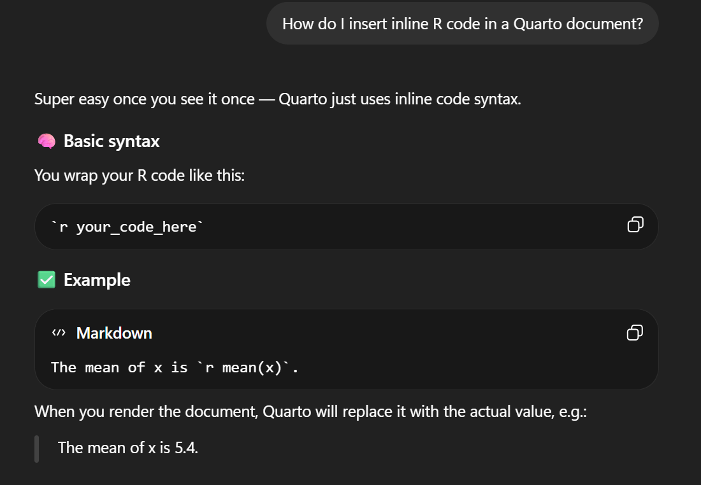
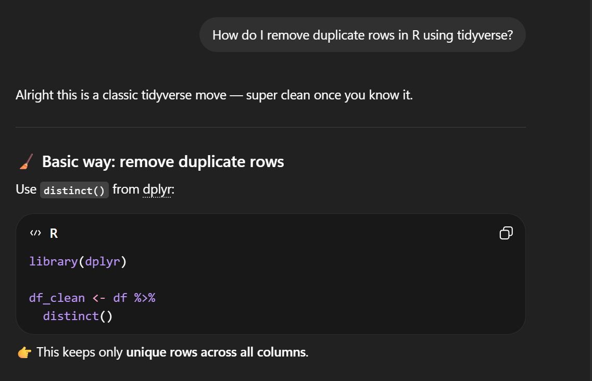
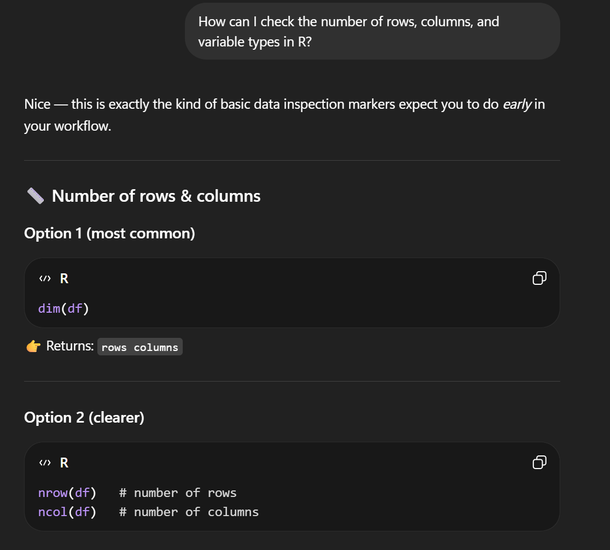
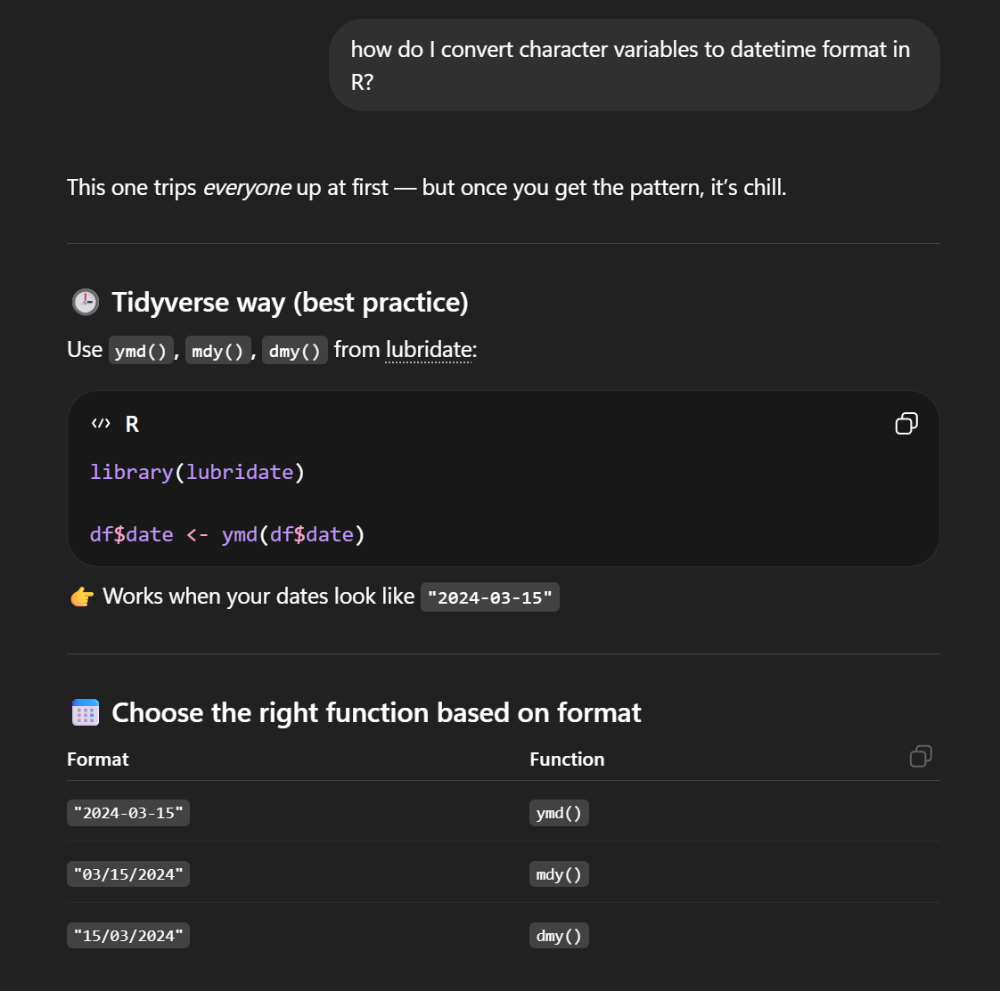
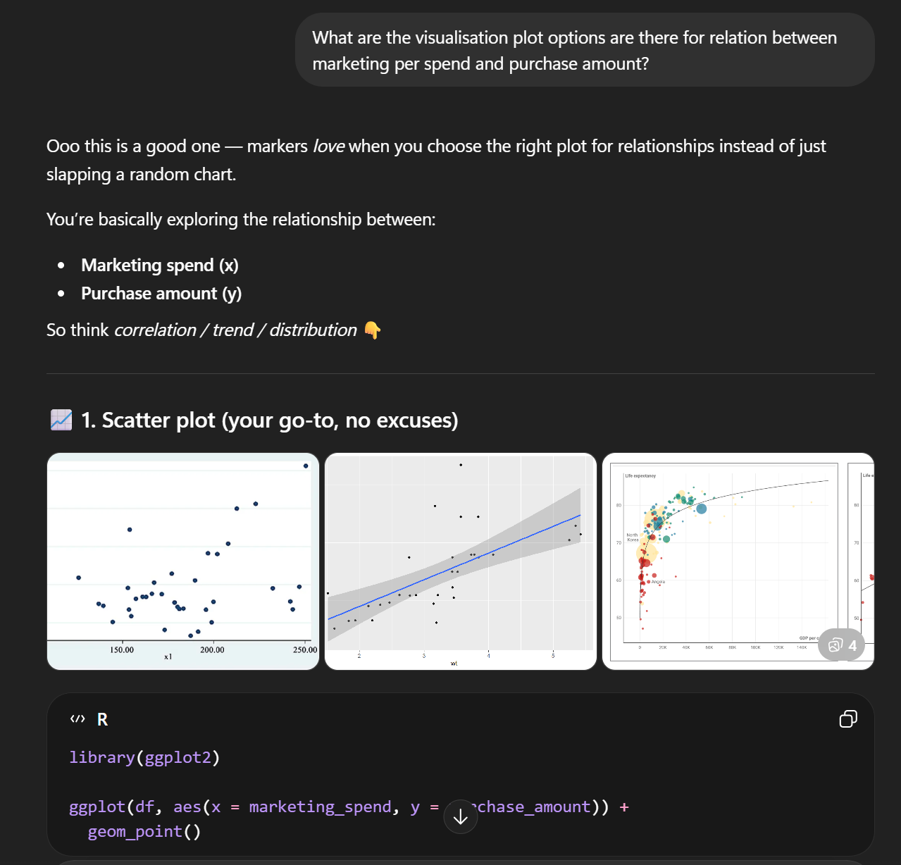
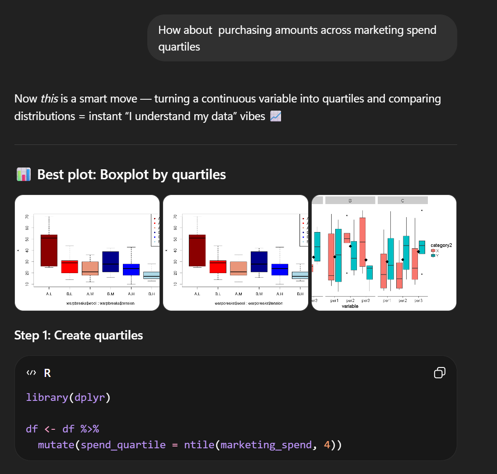
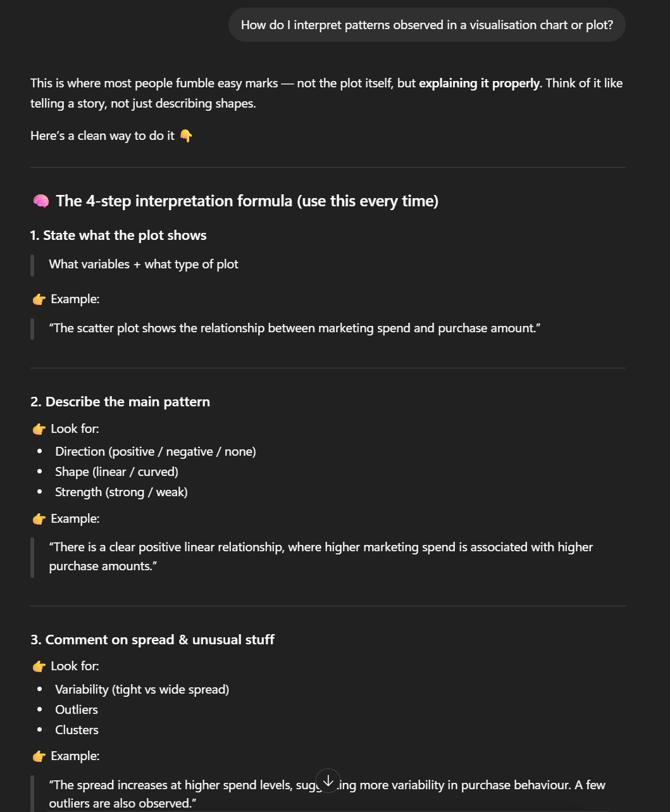

# Appendix: AI usage declaration

## Explanations and screenshots

**Query 1: Using inline R code in Quarto**

-   Prompt: "How do I insert inline R code in a Quarto document?"
-   Purpose: To dynamically display values such as the number of observations and variables directly in the report.

**Query 2: Handling duplicate records**

-   Prompt: "How do I remove duplicate rows in R using tidyverse?"
-   Purpose: To clean the dataset and ensure each observation is unique.

**Query 3: Exploring dataset structure**

-   Prompt: "How can I check the number of rows, columns, and variable types in R?"
-   Purpose: To summarise the dataset and describe its structure in the report.

**Query 4: Working with date-time data**

-   Prompt: "How do I convert character variables to datetime format in R?"
-   Purpose: To correctly process time-related variables in the dataset.

**Query 5: Selecting appropriate plots**

-   Prompt: "What are the visualisation plot options are there for relation between marketing per spend and purchase amount?", "How about purchasing amounts across marketing spend quartiles"
-   Purpose: To choose suitable visualisations for EDA.

**Query 6: Interpreting analysis results**

-   Prompt: "How do I interpret patterns observed in a bar chart or distribution plot?"
-   Purpose: To explain findings clearly in the results section.

## Link to chat

link: <https://chatgpt.com/share/69c8bbb2-2fb4-83a0-bdbe-d2df90ef3376>
